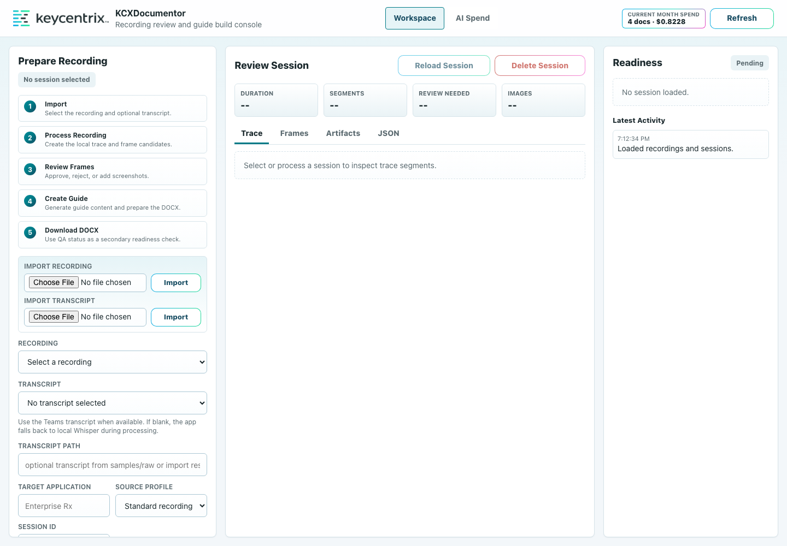
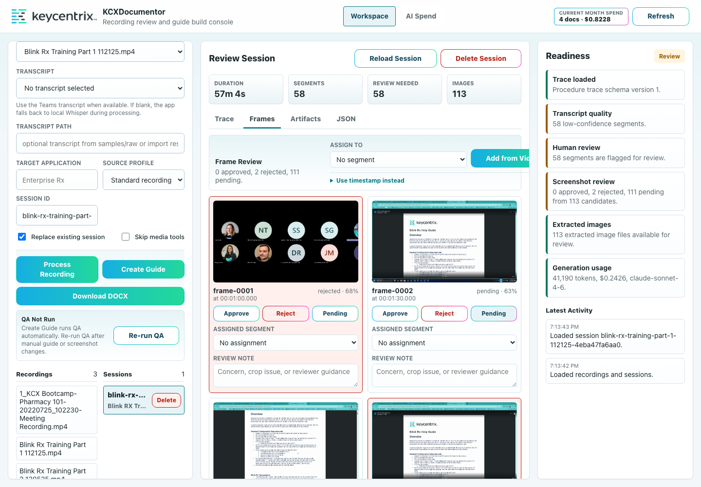
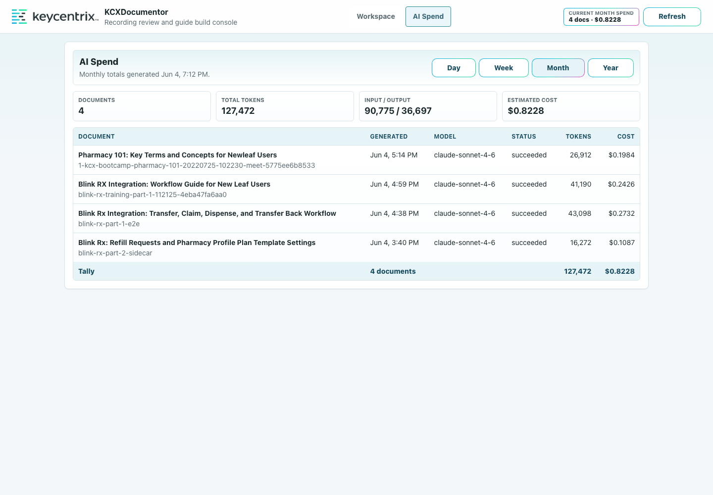

# KCXDocumentor User Guide

This guide walks through the local KCXDocumentor prototype from recording selection through DOCX download, QA review, and AI Spend tracking.

## Intended Audience

This guide is for business analysts, trainers, implementation team members, and documentation reviewers who need to turn recorded workflow walkthroughs into reviewable DOCX user guides.

## Before You Start

Confirm the local app server is running:

```bash
.venv/bin/python scripts/app_server.py --host 127.0.0.1 --port 8765
```

Open the console:

```text
http://127.0.0.1:8765
```

Sign in with your Microsoft account when prompted. Use **Logout** in the header when you are finished or need to switch accounts.

The Workspace opens with the preparation workflow on the left, session review in the center, and readiness/status information on the right.



Use recordings from:

```text
samples/raw/
```

Optional transcript files, such as Teams `.vtt` exports, should also be placed in `samples/raw/`.

## Workflow Overview

The workflow has five parts:

- Import the source recording and optional transcript.
- Process the recording into a local trace and candidate screenshots.
- Review frames before AI guide creation.
- Create the guide, which builds the DOCX and runs local QA.
- Download and review the customer-facing draft.

## Source Recording

Use the clearest available screen recording. Teams recordings can work, but reviewers should reject frames that show meeting overlays, participant tiles, title cards, or other non-application UI.

When a Teams transcript is available, use it for the first pass. Leave the transcript blank when you want KCXDocumentor to use local Whisper transcription.

## Step-by-Step Procedures

1. Open the console and sign in with your Microsoft account.
2. Open the **Workspace** page.
3. In **Recording**, choose the screen recording you want to process.
4. In **Transcript**, choose a transcript when one is available.
5. Leave the transcript blank when you want KCXDocumentor to use local Whisper transcription.
6. Set **Target Application** to the application being documented, such as `Newleaf Rx`.
7. Use **Source Profile**:
   - `Standard` for ordinary screen recordings.
   - `Teams Recording` for Teams recordings with meeting overlays, title cards, or participant chrome.
8. Choose **Process Recording**.
9. Wait for the session to appear in the session list for the selected recording.
10. Open the **Frames** review area.
11. Approve screenshots that clearly show the application state needed for a step.
12. Reject screenshots that show Teams overlays, title cards, irrelevant transitions, or confusing UI states.
13. Use **Add from Video** when the automatic candidates missed an important screen.
14. In the video picker, pause on the desired frame and choose **Use Current Time**.
15. Add a short reviewer note when a frame, term, or step needs human verification.
16. Choose **Create Guide**.
17. Keep the page open while the AI progress message is active.
18. When guide creation finishes, choose **Download DOCX**.
19. Open the DOCX and review it as a customer-facing draft.

**Create Guide** performs the AI draft, DOCX build, and local QA check as one chained action. **Download DOCX** becomes useful after that workflow succeeds.

The **Frames** tab is where reviewers approve, reject, assign, and comment on candidate screenshots. Frames are grouped as **Recommended**, **Alternates**, and **Needs Attention**. Rejected images are excluded from the AI guide context, while reviewer notes remain available as guidance.

When a reviewer adds a missing frame from the video picker, KCXDocumentor extracts the image locally, runs local OCR when Tesseract is available, maps the frame to the selected segment, and includes the compact OCR/context evidence in guide generation unless the frame is rejected.



## Review The Result

Check the generated guide for:

- A specific title that names the workflow.
- A purpose written for the reader, not for the pipeline.
- Clear section headings when the recording covers more than one workflow.
- Second-person instructions, such as "Select Save" instead of "I clicked Save."
- Screenshots that match the step they support.
- Word comments for reviewer concerns instead of inline AI notes in the body.
- No hidden model reasoning, prompt text, or internal pipeline language.

Use **Re-run QA** after changing screenshot approvals or regenerating the guide. QA is local and does not use AI tokens.

## Troubleshooting

If the AI call fails, the workflow stops and the Latest Activity area shows the failure reason. When Anthropic returned token usage before the failure, KCXDocumentor records that usage in AI Spend.

Common examples:

- The model returned incomplete JSON.
- The response exceeded the available output budget.
- The API request failed.
- The source trace is missing or invalid.

When a failed AI attempt includes usage data, it is stored in the Cosmos-backed AI Spend history.

The failed session may also have:

```text
artifacts/generated/<sessionId>/generation_failure.json
```

Failed attempts count toward AI Spend but do not count as successful documents.

## Expected Results

A successful run produces a DOCX file in the selected session's generated artifacts. The guide should contain reader-facing procedures, selected screenshots, and reviewer comments only where human verification is needed.

The UI should also show session readiness, generated files, QA status, and per-session AI usage. Aggregate usage remains visible in **AI Spend** even if old sessions are deleted.

## Use AI Spend

1. Choose **AI Spend** in the top navigation.
2. Use **Day**, **Week**, **Month**, or **Year** to change the reporting range.
3. Review:
   - **Documents**: successful generated documents.
   - **Tokens**: total input and output tokens across successful and failed AI attempts.
   - **Input / Output**: token direction for cost analysis.
   - **Pages**: estimated DOCX pages produced for successful guides.
   - **Estimated Cost**: estimated Anthropic cost for the selected range.
   - **Cost / Page**: estimated AI cost divided by generated pages.
4. Review the document table for per-guide pages, tokens, cost, and cost per page.
5. Check the header **Current Month Spend** for calendar-month visibility without opening the report page.

AI Spend persists even when sessions or generated artifacts are deleted. This is intentional so usage reporting remains auditable. Page counts are captured when the DOCX is available; older or failed attempts may show no page count. New guide generations write to AI Spend automatically.



## Delete Old Sessions

Use **Delete Session** when a processed session is stale or tied to deleted local material.

Deleting a session removes:

```text
samples/processed/<sessionId>
artifacts/generated/<sessionId>
```

Deleting a session does not remove:

```text
samples/raw/
```

It also does not remove Cosmos-backed AI Spend history.

## Recommended First Test

For the first validation run:

1. Select a representative Newleaf Rx workflow recording.
2. Select the transcript sidecar if one is available.
3. Set the target application to `Newleaf Rx`.
4. Use `Teams Recording` if the source includes Teams overlays.
5. Process the recording, review frames, create the guide, and download the DOCX.
6. Open **AI Spend** and confirm the successful generation appears in the current month.
